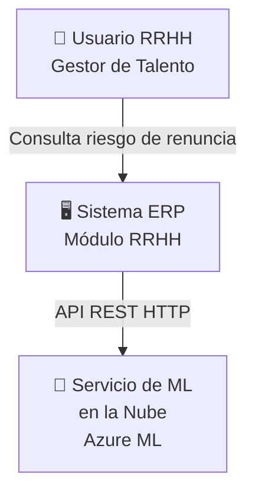
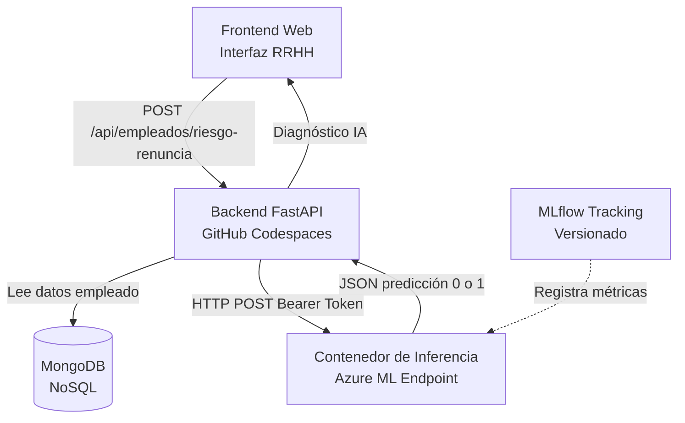

# Diagrama de Arquitectura - ERP RRHH con IA Predictiva

## Nivel 1 - Contexto del Sistema

```mermaid
graph TB
    U[👤 Usuario RRHH\nGestor de Talento] -->|Consulta riesgo de renuncia| ERP
    ERP[🖥️ Sistema ERP\nMódulo RRHH] -->|API REST HTTP| ML
    ML[🤖 Servicio de ML\nen la Nube\nAzure ML]
```

## Nivel 2 - Contenedores

```mermaid
graph TB
    FE[Frontend Web\nInterfaz RRHH] -->|POST /api/empleados/riesgo-renuncia| API
    API[Backend FastAPI\nGitHub Codespaces] -->|Lee datos empleado| DB[(MongoDB\nNoSQL)]
    API -->|HTTP POST Bearer Token| AML[Contenedor de Inferencia\nAzure ML Endpoint]
    AML -->|JSON predicción 0 o 1| API
    API -->|Diagnóstico IA| FE
    MLF[MLflow Tracking\nVersionado] -.->|Registra métricas| AML
```
